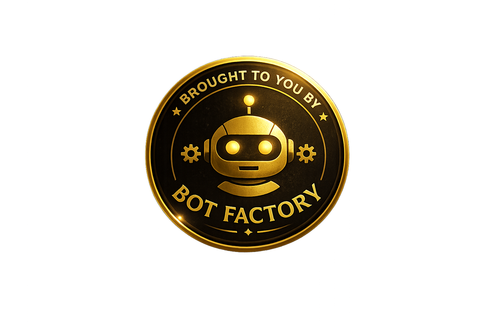

<p align="center">
  
</p>

<h1 align="center">Bot Factory</h1>

<p align="center">
  A serverless RAG chatbot platform. Write a config, add knowledge data, deploy — get a working AI chatbot backed by AWS Bedrock.
</p>

# BOT-FACTORY

A serverless chatbot platform deployed on AWS. The backend is a streaming Lambda function connected to DynamoDB and S3, with AI powered by AWS Bedrock (Titan V2 embeddings + Claude responses).

## Architecture

```
Browser
  → CloudFront (production) / nginx (local)
    → S3 (static frontend: HTML, JS, CSS, assets)
    → Lambda Function URL → Lambda (factory/streaming_handler.py)
                              → DynamoDB BotFactoryRAG (embeddings)
                              → DynamoDB BotFactoryLogs (chat logs)
                              → S3 (bot configs, prompts, knowledge data)
                              → Bedrock (embeddings + Claude responses)
```

Local development uses Docker Compose (nginx + LocalStack) and a Flask dev server.

## Project Structure

```
/
├── app/                       ← Static frontend (HTML, CSS, JS, assets)
│
├── factory/                   ← Lambda source code
│   ├── streaming_handler.py   ← Streaming chat Lambda (Function URL, SSE)
│   └── core/                  ← Shared RAG engine (never bot-specific)
│       ├── chatbot.py         ← Orchestrator: retrieval → Claude → response
│       ├── retrieval.py       ← DynamoDB GSI query + cosine similarity search
│       ├── chunker.py         ← S3 YAML → text chunks
│       ├── generate_embeddings.py ← chunks → Bedrock Titan V2 → DynamoDB
│       ├── bot_utils.py       ← Config loader (S3), chat logger (DynamoDB)
│       └── auth.py            ← API key validation (DynamoDB)
│
├── scripts/
│   ├── bots/                  ← Bot source files (config, prompt, data)
│   │   ├── RobbAI/            ← Rob's resume AI assistant
│   │   └── the-fret-detective/← Guitar learning bot
│   ├── build_lambda.sh        ← Package Lambda zip (.build/bot-factory.zip)
│   ├── package_streaming.sh   ← Package streaming Lambda zip (.build/streaming.zip)
│   ├── scaffold_bot.py        ← Scaffold a new bot's local structure
│   ├── new-version.sh         ← Start a new version (branch + release notes stub)
│   ├── gen_api_key.py         ← Generate bot-scoped API keys
│   ├── setup_bot_s3.sh        ← Upload all bots to LocalStack S3 (used by make up)
│   └── init-dynamodb.sh       ← Create DynamoDB tables in LocalStack
│
├── Versions/                  ← Release notes + enhancement docs per version
│   ├── v1.0.0/
│   ├── v2.0.0/
│   └── ...
│
├── terraform/                 ← Infrastructure as code (S3, DynamoDB, IAM, Lambda)
├── dev_server.py              ← Flask dev server (SSE streaming local testing)
├── docker-compose.yml         ← Local dev environment (nginx + LocalStack)
└── Makefile                   ← All commands: run make help
```

## Bots

Bot source files live in `scripts/bots/{bot_id}/`:

| Bot                | ID                   | Description                                     |
| ------------------ | -------------------- | ----------------------------------------------- |
| RobbAI             | `RobbAI`             | Resume AI assistant on robrose.info              |
| The Fret Detective | `the-fret-detective` | Electric guitar instruction bot                  |

> **[Full bot development guide: factory/README.md](factory/README.md)**

## Local Development

```bash
make up
```

This starts Docker (nginx on port 8080, LocalStack on 4566), initializes DynamoDB tables and S3, and starts the Flask dev server on port 8001.

```bash
# Send a test chat message
make test-chat BOT=RobbAI MSG="What does Rob do?"

# See all available commands
make help
```

The frontend runs at `http://localhost:8080`. The API runs at `http://localhost:8001`.

## Deploy

### Infrastructure (first time or code changes)

```bash
# 1. Build and apply Terraform
make deploy-infra

# 2. Deploy the streaming Lambda (separate Function URL)
make deploy-streaming
```

### Bot data (per bot, re-run on data changes)

```bash
make deploy-bot-prod bot=RobbAI
```

This uploads config, prompt, and data to S3, then generates embeddings in production DynamoDB.

### Frontend

```bash
aws s3 sync app/ s3://<your-bucket>/
aws cloudfront create-invalidation --distribution-id <your_id> --paths "/*"
```

For bot-specific deploy steps and the full workflow, see [factory/README.md](factory/README.md).
